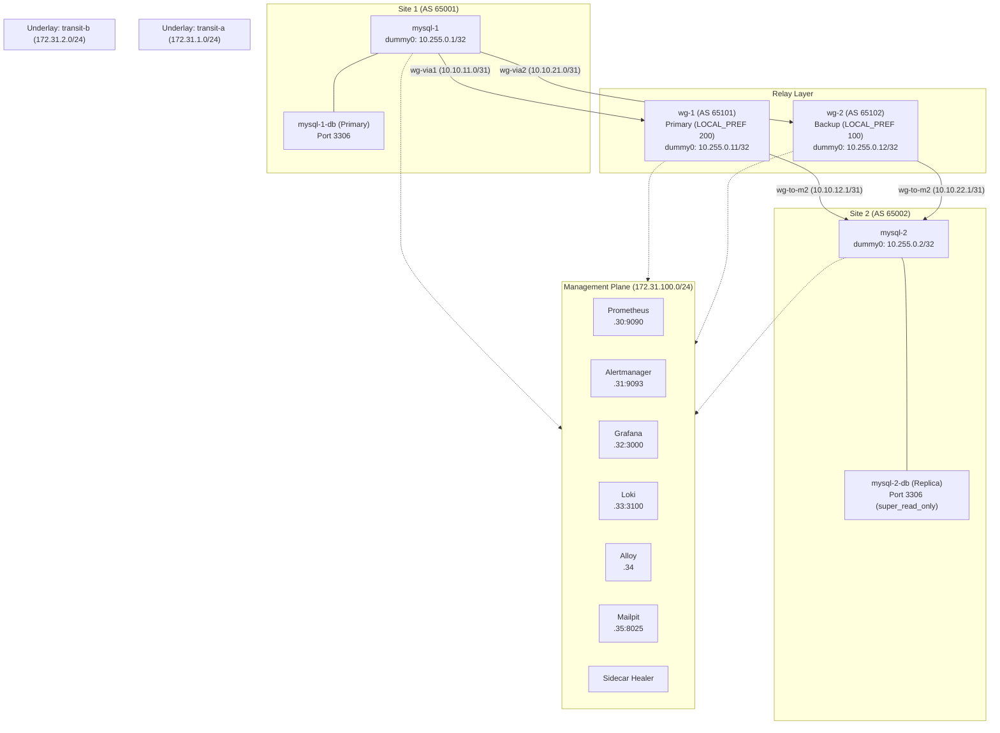

# sync-or-swim

A highly available network link and database replication topology between two MySQL sites across redundant WireGuard relays, built for the ArvanCloud SRE challenge.

The platform interconnects two simulated geographic database sites (`mysql-1` and `mysql-2`) across two independent WireGuard relays (`wg-1` primary, `wg-2` backup). Dynamic routing with eBGP and BFD automatically handles sub-second failover between relays. MySQL 8.4 GTID replication binds to stable loopback interfaces with source address rewriting; during manual failovers, the replication connection survived when the next hop changed. The entire infrastructure is deployed and configured declaratively using Ansible and Docker Compose.

---

## Requirements and Bonus Checklist

| Requirement / Item | Description | Status | Implementation Links |
|---|---|---|---|
| **Part 1: Network & Routing** | Redundant relays, dynamic failover, MTU & keepalives | Done | [roles/wireguard/](roles/wireguard/), [roles/frr/](roles/frr/), [docs/architecture.md](docs/architecture.md) |
| ↳ WireGuard server failure | Relay down; BFD detects and BGP fails over to surviving relay | In progress (manual run: kill 0.21 s, pause 0.95 s; automated suite in progress) | [docs/architecture.md](docs/architecture.md) |
| ↳ Network path failure | Underlay transit path broken; BFD detects and route shifts | In progress (automated suite in progress) | [docs/architecture.md](docs/architecture.md) |
| ↳ End-to-end connectivity loss | Both paths down; AllPathsDown alert fires and replication waits | In progress (automated suite in progress) | [docs/runbooks/AllPathsDown.md](docs/runbooks/AllPathsDown.md) |
| ↳ Path recovery after failure | Primary path restores; BGP re-establishes and traffic returns | In progress (manual run: 1.6 s failback; automated suite in progress) | [docs/architecture.md](docs/architecture.md) |
| **Part 2: MySQL HA** | MySQL 8.4 GTID replication between loopbacks, read-only replica | Done | [roles/mysql/](roles/mysql/), [docs/adr/0003-loopback-addressing-source-rewrite.md](docs/adr/0003-loopback-addressing-source-rewrite.md), [docs/adr/0005-no-automatic-db-promotion.md](docs/adr/0005-no-automatic-db-promotion.md) |
| **Part 3: Monitoring & Alerting** | Prometheus, Alertmanager, Grafana, exporters, runbooks | Done | [roles/monitoring/](roles/monitoring/), [roles/exporters/](roles/exporters/), [monitoring/prometheus/rules/alerts.yml](monitoring/prometheus/rules/alerts.yml), [docs/runbooks/](docs/runbooks/) |
| **Part 4: Logs & Troubleshooting** | Centralized logs with Loki/Alloy, netlink route-monitor, wg-watch | Done | [roles/logging/](roles/logging/), [docs/logging.md](docs/logging.md) |
| **Ansible-Only Deployment** | Fully automated single-command orchestration (`make up`) | Done | [playbooks/site.yml](playbooks/site.yml), [roles/lab_infra/](roles/lab_infra/) |
| **GitHub Delivery** | Complete Git history, CI workflows, and GHCR container releases | Done | [.github/workflows/ci.yml](.github/workflows/ci.yml), [.github/workflows/release.yml](.github/workflows/release.yml) |
| **Bonus 1: Sub-second Failover** | BFD timers 300 ms x 3 (0.21 s crash, 0.95 s pause detection) | Done | [inventory/docker/group_vars/all/network.yml](inventory/docker/group_vars/all/network.yml), [docs/adr/0004-bfd-timers-300x3.md](docs/adr/0004-bfd-timers-300x3.md) |
| **Bonus 2: Route Flap Prevention** | Delayed failback / dampening policy | In progress | [docs/results.md](docs/results.md) (generated by make chaos) |
| **Bonus 3: ECMP Load Balancing** | Multipath relax, dual active next-hops toggle | Done | [roles/frr/templates/frr.conf.j2](roles/frr/templates/frr.conf.j2) (`routing_mode: ecmp`) |
| **Bonus 4: Routing Security** | TCP MD5 auth, GTSM (TTL 1), prefix lists, non-transit filtering | Done | [roles/frr/templates/frr.conf.j2](roles/frr/templates/frr.conf.j2) |
| **Bonus 5: Automated Failback** | Done: BGP returns traffic to wg-1 automatically (1.6 s); a hold-down against flapping is in progress | Done | [docs/architecture.md](docs/architecture.md) |
| **Bonus 6: Automated Failure Tests** | Automated chaos test suite running failure scenarios | In progress | [Makefile](Makefile) (`make chaos`) |
| **Bonus 7: Automated Troubleshooting**| Automated diagnostic collector & alertmanager webhook | In progress | |
| **Bonus 8: Integration Tests** | 138 automated pytest testinfra integration tests | Done | [tests/integration/](tests/integration/) |
| **Bonus 9: Root Cause Postmortems** | Problem log in docs/notes.md; postmortems in progress | In progress | [docs/notes.md](docs/notes.md) |

---

## Topology



---

## Addressing and ASN Table

| Node | ASN | Loopback (`dummy0`) | Transit-A (`ul-a`) | Transit-B (`ul-b`) | Management (`mgmt0`) | WireGuard Tunnels |
|---|---|---|---|---|---|---|
| `mysql-1` | 65001 | 10.255.0.1/32 | 172.31.1.11 | 172.31.2.11 | 172.31.100.11 | `wg-via1` (10.10.11.0/31)<br/>`wg-via2` (10.10.21.0/31) |
| `mysql-2` | 65002 | 10.255.0.2/32 | 172.31.1.12 | 172.31.2.12 | 172.31.100.12 | `wg-via1` (10.10.12.0/31)<br/>`wg-via2` (10.10.22.0/31) |
| `wg-1` | 65101 | 10.255.0.11/32 | 172.31.1.21 | — | 172.31.100.21 | `wg-to-m1` (10.10.11.1/31)<br/>`wg-to-m2` (10.10.12.1/31) |
| `wg-2` | 65102 | 10.255.0.12/32 | — | 172.31.2.22 | 172.31.100.22 | `wg-to-m1` (10.10.21.1/31)<br/>`wg-to-m2` (10.10.22.1/31) |

---

## Quick Start

### Prerequisites
- Linux host with Docker 28.1+ and the Compose v2 plugin
- WireGuard kernel module loaded (`sudo modprobe wireguard`)
- Python 3.12+ and `make`

### Commands
```bash
make deps        # Create virtualenv and install Ansible collections
make up          # Build image and launch entire lab (idempotent, second run changed=0)
make test        # Run integration test suite (138 tests)
make chaos       # Run automated failure and chaos test suite (in progress)
make lint        # Run yamllint, ansible-lint (production profile), and shellcheck
make down        # Destroy lab containers and networks cleanly
```

### Management Services
- **Grafana:** [http://127.0.0.1:3000](http://127.0.0.1:3000) (User: `admin`, Password in `build/secrets/grafana_admin`)
- **Prometheus:** [http://127.0.0.1:9090](http://127.0.0.1:9090)
- **Alertmanager:** [http://127.0.0.1:9093](http://127.0.0.1:9093)
- **Mailpit (Alert Emails):** [http://127.0.0.1:8025](http://127.0.0.1:8025)

---

## Measured Results

Baseline performance recorded on manual test runs:
- **Failover on `docker kill wg-1`:** 0.21 s
- **Failover on `docker pause wg-1`:** 0.95 s (BFD)
- **Failback to `wg-1`:** 1.6 s (6.7 s including container boot)
- **Packet loss during failover:** 0 lost pings at 50 ms test intervals in those manual runs
- **Host reboot recovery:** A full host reboot recovered everything without intervention: BGP Established, path via `wg-1` with loopback source, replication running, 22/22 Prometheus targets up.
- **Integration test coverage:** 138 integration tests pass and a second `make up` changes nothing.

The full measured table will live in [docs/results.md](docs/results.md) (generated by `make chaos`).

---

## Architectural Documentation & Runbooks

- [System Architecture](docs/architecture.md): System layers, packet flow, and failover mechanics.
- [Central Logging Guide](docs/logging.md): Loki and Alloy pipeline, sidecar design, and LogQL queries.
- [Development Notes & Discoveries](docs/notes.md): Real engineering problem log.
- **Architectural Decision Records (ADRs):**
  - [ADR 0001: eBGP over OSPF](docs/adr/0001-ebgp-over-ospf.md)
  - [ADR 0002: Docker Lab Driven by Ansible](docs/adr/0002-docker-lab-driven-by-ansible.md)
  - [ADR 0003: Loopback Addressing and Source Rewrite](docs/adr/0003-loopback-addressing-source-rewrite.md)
  - [ADR 0004: BFD Timers 300x3](docs/adr/0004-bfd-timers-300x3.md)
  - [ADR 0005: No Automatic DB Promotion](docs/adr/0005-no-automatic-db-promotion.md)
  - [ADR 0006: Sidecars in Node Namespaces and Healer](docs/adr/0006-sidecars-in-node-namespaces-and-healer.md)
- **Operational Runbooks:**
  - [AllPathsDown](docs/runbooks/AllPathsDown.md)
  - [BFDPeerDown](docs/runbooks/BFDPeerDown.md)
  - [BGPSessionDown](docs/runbooks/BGPSessionDown.md)
  - [ExporterDown](docs/runbooks/ExporterDown.md)
  - [MySQLUnreachable](docs/runbooks/MySQLUnreachable.md)
  - [PathHighLatency](docs/runbooks/PathHighLatency.md)
  - [PathHighPacketLoss](docs/runbooks/PathHighPacketLoss.md)
  - [ReplicationIOStopped](docs/runbooks/ReplicationIOStopped.md)
  - [ReplicationLagHigh](docs/runbooks/ReplicationLagHigh.md)
  - [ReplicationSQLStopped](docs/runbooks/ReplicationSQLStopped.md)
  - [RouteFlapping](docs/runbooks/RouteFlapping.md)
  - [TrafficOnBackupPath](docs/runbooks/TrafficOnBackupPath.md)
  - [WireGuardHandshakeStale](docs/runbooks/WireGuardHandshakeStale.md)

---

## CI and Releases

In CI, the node image is built once in the `image` job and saved as `dist/node-image.tar.gz`.
The `lab` job downloads this artifact, loads it via `make image-load`, and reuses it across test runs.
On tag pushes (`v*`), the `release` workflow creates a GitHub release with the image tarball and sha256 checksum.
It also publishes the image to GHCR under the release tag and content hash.
To run a released image locally without rebuilding, download `node-image.tar.gz` into `dist/` and run `make image-load`.
